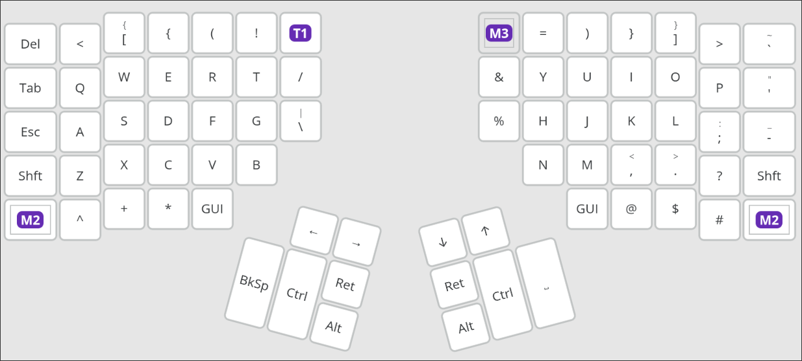

# Dotfiles

## Keyboard Layout (Kinesis Advantage 360)



---

## Dotfiles organization

The directories and files are organized to be managed with **GNU Stow**:

```bash
.
├── assets
│   └── kinesis_layout.png
├── emacs
├── fastfetch
├── i3
├── README.md
├── tmux-sessionizer
└── wpp.jpg
```

To apply the configurations on a Unix-like system that follows the **Filesystem Hierarchy Standard**,
make sure **stow** is installed:

```bash
# e.g., installation on Arch Linux
sudo pacman -S stow

# Clone the repository and apply the desired configuration(s)
git clone https://github.com/gnix0/dotfiles.git

cd ~/path/to/local/repo

stow <app_dir_name>
```

> [!NOTE]
> These configurations are tailored to my own system and workflow. Feel free to use them as reference or
> inspiration, but do not expect them to work out of the box on your machine. Building your own configuration
> is one of the best ways to learn the tools you use and create an environment that fits your own workflow.

---

# Guide for the Org-mode Workflows

This Org setup is divided into four workflows:

* Work logging
* Notes
* Task management
* Code-related task tracking

The main entry points are:

| Key     | Action                               |
| ------- | ------------------------------------ |
| `C-c c` | Capture something                    |
| `C-c a` | Open the Org agenda dispatcher       |
| `C-c l` | Store a link to the current location |

Most information should enter the system through `org-capture`. The Org files themselves are primarily for reviewing, organizing, and updating existing entries.

---

# Daily Workflow

A normal day follows, roughly, this cycle:

1. Open the agenda and review active work.
2. Capture tasks, notes, and code-related items as they appear.
3. Update task states while working.
4. Record meaningful accomplishments in the work log.
5. Review the agenda and unfinished work before finishing the day.

The central command for reviewing the system is:

`C-c a`

From the agenda dispatcher:

| Key | View                            |
| --- | ------------------------------- |
| `a` | Agenda                          |
| `t` | Global TODO list                |
| `m` | Match tasks by tags             |
| `M` | Match only TODO entries by tags |

For a broad task review:

`C-c a t`

For reviewing tasks by area or context:

`C-c a m`

Examples of useful tag searches:

`work`

`studies`

`backend`

`@bug`

`work+backend`

`studies+@research`

The agenda reads every Org file under `~/org`.

---

# Work Log

The work log records accomplishments and meaningful progress.

It is not a task list. Entries describe things that were actually done or achieved.

Capture an entry with:

`C-c c w`

The entry is automatically placed under the current date in:

`~/org/work-log.org`

Example:

```org
* Implemented authentication token refresh handling
```

Another example:

```org
* Investigated excessive allocation in the parser
```

The work log should answer:

> What did I accomplish today?

Capture entries throughout the day or during an end-of-day review.

Do not use the work log to describe future work. Future work belongs in the TODO system.

---

# Notes

Notes are used for thoughts and information that should be retained without interrupting the current activity.

Capture a note with:

`C-c c n`

Notes are stored under `Random Notes` in:

`~/org/notes.org`

Examples:

```org
** Look into region-based memory allocation
```

```org
** Helly-type results may have an interesting interpretation for distributed constraint systems
```

```org
** Check whether Eglot exposes this information directly through Eldoc
```

Use notes when:

* An idea appears while doing something else.
* Something should be investigated later.
* A thought may be useful in a few days.
* Some information is worth retaining.
* Following the thought immediately would interrupt current work.

The notes workflow answers:

> What do I want to remember?

A note does not imply that any action must be taken.

If an item requires action, create a TODO instead.

---

# Task Management

Tasks are used for work and studies.

Capture a normal task with:

`C-c c t`

The initial entry is created as:

```org
* TODO [#B] Task title
:Created: [timestamp]
```

Tasks are stored under `Tasks` in:

`~/org/todos.org`

The default priority is `B`.

The task system answers:

> What work needs to be tracked?

Tasks should generally represent work where state, priority, or historical progress is useful.

---

# Task States

The task lifecycle is:

```text
TODO
  ↓
PLANNING
  ↓
IN-PROGRESS
  ↓
VERIFYING
  ↓
DONE
```

Two states represent exceptional conditions:

```text
BLOCKED
OBE
WONT-DO
```

The states mean:

| State         | Meaning                                                    |
| ------------- | ---------------------------------------------------------- |
| `TODO`        | Known work that has not started                            |
| `PLANNING`    | The implementation or approach is being designed           |
| `IN-PROGRESS` | Active work is occurring                                   |
| `VERIFYING`   | Work is complete enough to test, review, or validate       |
| `BLOCKED`     | Progress depends on an external condition                  |
| `DONE`        | Successfully completed                                     |
| `OBE`         | Overcome by Events; circumstances made the task irrelevant |
| `WONT-DO`     | Explicit decision not to perform the task                  |

Change the state of a task with:

`C-c C-t`

Org presents the available states and their associated keys:

| Key | State       |
| --- | ----------- |
| `t` | TODO        |
| `p` | PLANNING    |
| `i` | IN-PROGRESS |
| `v` | VERIFYING   |
| `b` | BLOCKED     |
| `d` | DONE        |
| `o` | OBE         |
| `w` | WONT-DO     |

State changes automatically maintain the configured task history.

Some transitions request a note. Use the note to explain information that will matter when reviewing the task later.

For example:

```org
- State "BLOCKED" from "IN-PROGRESS" [timestamp]
  Waiting for the upstream API contract to be finalized.
```

Or:

```org
- State "OBE" from "TODO" [timestamp]
  The feature was removed during the protocol redesign.
```

State-change notes should explain why the transition happened, not restate the state name.

---

# Priorities

Tasks use Org priorities.

The default capture priority is:

`[#B]`

Change priority with:

`C-c ,`

Then select the desired priority.

The intended interpretation is:

| Priority | Meaning                                  |
| -------- | ---------------------------------------- |
| `A`      | Important or time-sensitive tracked work |
| `B`      | Normal work                              |
| `C`      | Low-priority work                        |

Priority describes the importance of a task relative to other tracked tasks.

It does not describe task state.

For example:

```org
* TODO [#A] Fix data corruption during concurrent writes
```

```org
* IN-PROGRESS [#B] Implement new parser
```

```org
* TODO [#C] Clean up obsolete test helpers
```

---

# Tags

Tags classify tasks along three dimensions:

* Work type
* Area
* Context

Edit tags with:

`C-c C-q`

## Work Type

Exactly one work-type tag should normally be selected.

| Tag         | Key | Meaning                                                 |
| ----------- | --- | ------------------------------------------------------- |
| `@bug`      | `b` | Defect or incorrect behavior                            |
| `@feature`  | `f` | New functionality                                       |
| `@chore`    | `c` | Maintenance or routine work                             |
| `@research` | `r` | Investigation or exploratory work                       |
| `@refactor` | `R` | Structural improvement without intended behavior change |

These tags are mutually exclusive.

## Area

Area tags describe which part of a system the task concerns.

| Tag        | Key |
| ---------- | --- |
| `backend`  | `k` |
| `frontend` | `F` |
| `infra`    | `i` |
| `docs`     | `d` |
| `testing`  | `t` |

Multiple area tags may be used when appropriate.

Example:

```org
* TODO [#B] Add integration coverage :@chore:backend:testing:
```

## Context

Context describes the broader environment the task belongs to.

| Tag       | Key |
| --------- | --- |
| `work`    | `w` |
| `studies` | `p` |

Example:

```org
* IN-PROGRESS [#B] Study ownership patterns :@research:studies:
```

A well-classified task might look like:

```org
* TODO [#A] Fix transaction retry handling :@bug:backend:work:
```

The classification can then be used from the agenda to review specific kinds of work.

---

# Code-related TODOs

Code TODOs connect a tracked task to the code that caused the task to exist.

While visiting the relevant source location, place point on the line associated with the issue.

Then run:

`C-c c c`

The task is stored under `Code Related Tasks` in:

`~/org/todos.org`

The captured entry contains:

* The task title
* Creation timestamp
* Active region contents, when applicable
* A link to the capture context
* A proposed solution field

Example:

```org
* TODO [#B] Remove unnecessary intermediate allocation
:Created: [timestamp]

[[file:...][source context]]

Proposed Solution: Reuse the parsing buffer instead of constructing a temporary string.
```

The intended workflow is:

1. Encounter a bug, optimization opportunity, refactoring need, or important code concern.
2. Stay at the relevant source location.
3. Run `C-c c c`.
4. Describe the task.
5. Write a proposed solution if one is already apparent.
6. Finish the capture and continue the current work.

This avoids interrupting the current task merely because another issue was discovered.

Later, visit the task and follow its source link.

Use:

`C-c C-o`

Because `org-return-follows-link` is enabled, `RET` on the link also follows it.

The code TODO workflow answers:

> What did I notice in the code that requires future action?

Typical uses include:

* Bugs discovered while implementing another feature.
* Optimization opportunities.
* Refactoring candidates.
* Suspicious behavior requiring investigation.
* Technical details that will be difficult to rediscover later.

If useful, select the relevant source text before invoking the capture. `%i` inserts the initial captured contents into the task.

---

# Links

Store a link to the current location with:

`C-c l`

This uses `org-store-link`.

The stored link can later be inserted in Org with:

`C-c C-l`

Links are useful for connecting notes and tasks to relevant files, source locations, or other Org entries.

Follow an Org link with:

`C-c C-o`

or simply:

`RET`

The latter works because links are configured to follow on Return.

---

# Recommended Start-of-Day Review

Open the TODO overview:

`C-c a t`

Review:

* `IN-PROGRESS` tasks first.
* `BLOCKED` tasks whose blocking condition may have changed.
* `VERIFYING` tasks waiting for validation.
* High-priority `TODO` tasks.
* `PLANNING` tasks that may now be ready for implementation.

Update states with:

`C-c C-t`

Adjust priorities with:

`C-c ,`

Adjust classification with:

`C-c C-q`

The goal is to determine what deserves active attention without maintaining a separate daily planning system.

---

# During the Day

Use capture immediately when information appears.

| Situation                              | Command   |
| -------------------------------------- | --------- |
| Accomplished meaningful work           | `C-c c w` |
| Thought of something worth remembering | `C-c c n` |
| Identified trackable future work       | `C-c c t` |
| Found an issue tied to source code     | `C-c c c` |

For existing tasks:

| Situation                             | Action                |
| ------------------------------------- | --------------------- |
| Designing the approach                | Move to `PLANNING`    |
| Started implementation                | Move to `IN-PROGRESS` |
| Testing or reviewing the result       | Move to `VERIFYING`   |
| External dependency prevents progress | Move to `BLOCKED`     |
| Successfully completed                | Move to `DONE`        |
| Events made the task irrelevant       | Move to `OBE`         |
| Explicitly decided against the task   | Move to `WONT-DO`     |

The capture system exists specifically to avoid abandoning the current context merely to organize newly discovered information.

Capture it, then return to the current work.

---

# End-of-Day Review

Open:

`C-c a t`

Review tasks touched during the day.

Make sure active tasks accurately reflect their current state.

If meaningful work was completed but not recorded, add it with:

`C-c c w`

The work log should provide a useful chronological record of accomplishments without requiring reconstruction from Git history, task state changes, or memory.

Any unfinished thought that should survive the day should be captured as either:

`C-c c n`

or:

`C-c c t`

depending on whether it merely needs to be remembered or requires action.

At the end of the review, the system should answer three questions clearly:

> What did I accomplish?

The work log.

> What do I want to remember?

The notes file.

> What work still requires action?

The TODO system.
